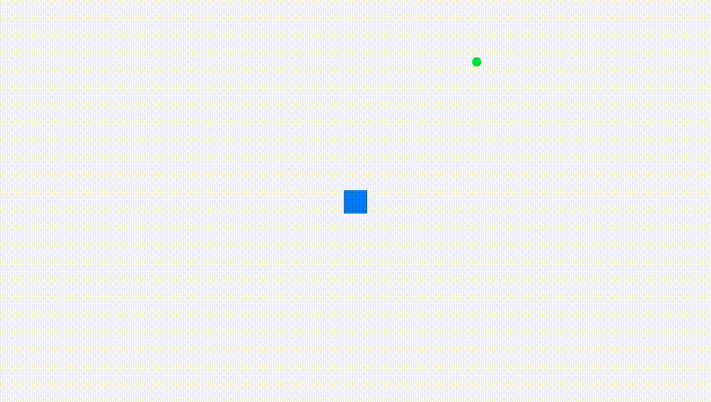

# CSnake
## Snake game implemented in c using Raylib for graphics drawing

The snake is implemented using a double ended queue (deque) by creating a doubly linked list.
Each node of the list contains the position of each block of the snake with x and y coordinates and movement is created by inserting a node at the head and deleting a node at the tail.
Eating a fruit grows the snake by one block and is done by inserting another node at the tail.

## Controls
W - up
A - left
S - down
D - right

Can only move orthogonal to current direction, tap to change directions.

## Issues
- Unfinished
- Missing game over screen
- Snake does not collide with screen bounds
- Probably more than I can think of right now
